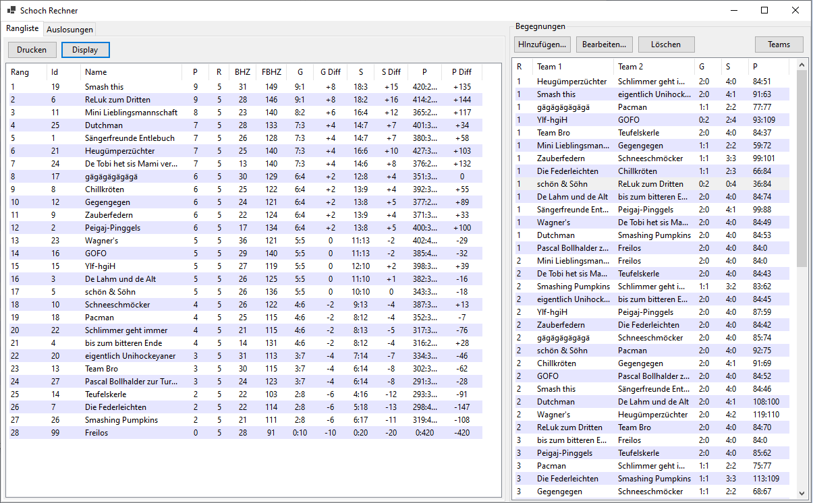
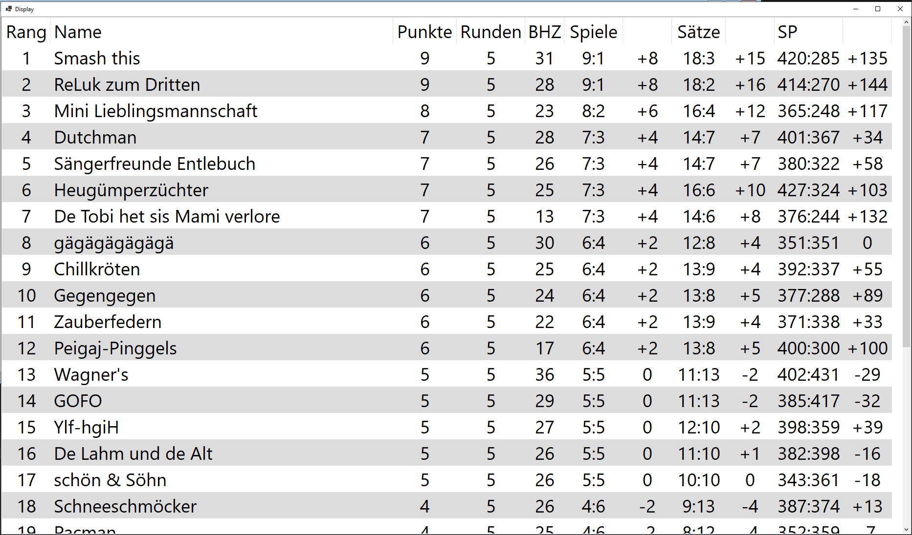
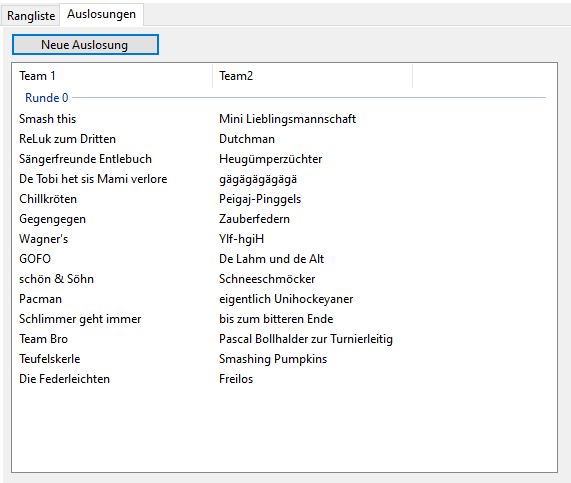
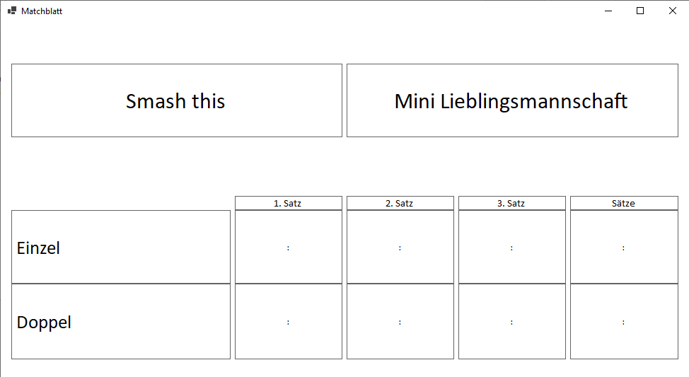
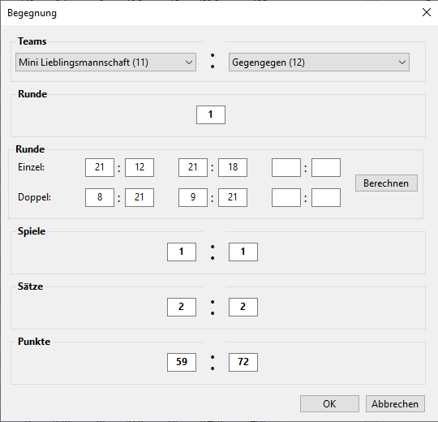

# Turniertools
Helferlein fürs Badmintonturnier

## SchochRechner
Für Turnierform Team gegen Team, pro Begegnung jeweils 1 Einzel und 1 Doppel

- Resultatverwaltung
- Auslosung einer neuen Schochrunde
- Berechnung der Buchholz- und Feinbuchholzzahl
- Berechnung der Rangliste  

## Todo
- Druckqualität Resultatblatt verbessern
- Resultatblatt ohne Sätze
- Resultatblatt mit eigenem Text oder Teams auswählen
- Global aktuelle Runde definieren (autofill bei Resultateingabe und Matchblatt)

## Changelog

### V1.5 (20.11.2025)
- Anzeige der aktuellen Runde im Displayfenster

### V1.4 (19.11.2024)
- Feldzuweisung für ausgeloste Paarung
- Aktuelle Runde festlegen
- Resultat direkt vom Draw aus eintragen

### V1.3 (16.11.2024)
- Wechseln zu .NET 8.0
- Auslosung Schochregeln überarbeitet (weniger Abstürze, getestet bis Runde 17)

### V1.2 (14.10.2023)
- Auslosung gemäss Schochregeln
- Erstellen und Ausdrucken der Matchblätter

### V1.1 (17.11.2022)
- Eingabe der erspielten Punkte
- Miteinbezug der Punkte in die Ranglistenberechnung

### V1.0 (2021)
- Erste Version

## Screenshots

### Hauptansicht mit Rangliste und Begegnungen

### Display für Grossbildschirm

### Auslosung
]

### Matchblatt

### Resultateingabe
